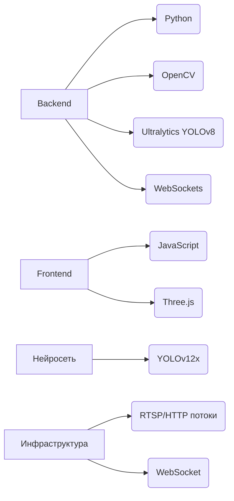

# PARKOVOZ-PRO 🚗💨 - Система мониторинга парковок  

[](https://github.com/ollxel/PARKOVOZ-PRO)  
*Интерактивная демонстрация работы системы*

**PARKOVOZ-PRO** - комплексное решение для автоматического мониторинга парковочных мест с использованием нейросетей. Система анализирует видеопоток в реальном времени, определяет свободные/занятые места и предоставляет удобный веб-интерфейс для визуализации данных.

## ✨ Ключевые возможности

| Функционал | Описание |
|------------|----------|
| 🚗 **Детекция авто** | Распознавание автомобилей через YOLOv12x |
| 🗺️ **Интерактивная карта** | Визуализация занятости мест в 2D/3D |
| 🛠️ **Редактор парковки** | Конструктор схем с сохранением конфигураций |
| ⚡ **Real-time мониторинг** | Передача данных через WebSocket |
| 📊 **Аналитика** | Статистика занятости и история изменений |

## 🛠 Технологический стек



## ⚙️ Установка и запуск

### Требования
- Python 3.7+
- NVIDIA GPU (рекомендуется)
- Доступ к RTSP/HTTP камере

### Пошаговая установка

1. Клонируйте репозиторий:
```bash
git clone https://github.com/ollxel/PARKOVOZ-PRO.git
cd PARKOVOZ-PRO
```

2. Установите зависимости:
```bash
pip install -r requirements.txt
```

3. Загрузите модель YOLOv12x:
```bash
wget https://example.com/yolov12x.pt -O RealParking/backend/yolov12x.pt
cp RealParking/backend/yolov12x.pt ToyParking/backend/
```

### Запуск системы
```bash
# Для реальной парковки
start_real1.bat --url rtsp://your_camera_ip --device gpu

# Для тестовой среды
start_toy.bat --url http://test_feed.jpg --device cpu
```

### Параметры запуска
| Параметр | Описание | По умолчанию |
|----------|----------|--------------|
| `--url` | URL видеопотока | Обязательный |
| `--model` | Путь к модели | `yolov12x.pt` |
| `--device` | Устройство (`cpu`/`gpu`) | `gpu` |
| `--ws-port` | WebSocket порт | `9000` |

## 🖥 Использование системы

### Веб-интерфейс
Откройте в браузере:
- `index.html` - мониторинг парковки
- `index_2.html` - редактор схем


### Горячие клавиши
| Комбинация | Действие |
|------------|----------|
| `S` | Сохранить снимок |
| `R` | Старт/стоп записи |
| `M` | Переключение режима |
| `P` | Режим разметки |
| `Q` | Выход из системы |

## 📄 Лицензия
Проект распространяется под лицензией **GPLv3**.  
Полный текст доступен в файле [LICENSE](LICENSE).

---
**PARKOVOZ-PRO** © 2025 - Интеллектуальная система мониторинга парковок  
[Документация](https://docs.example.com) | [Примеры конфигураций](configs/) | [Сообщить об ошибке](issues/new)
