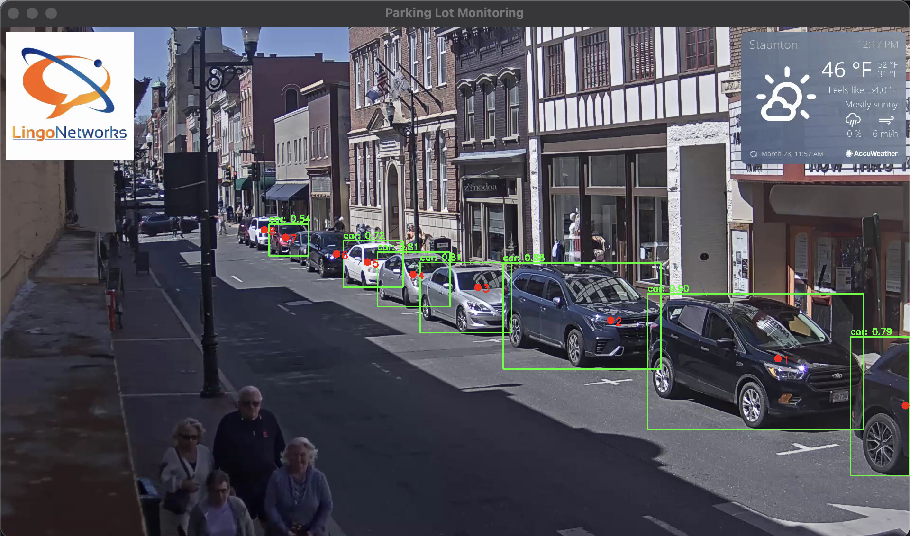
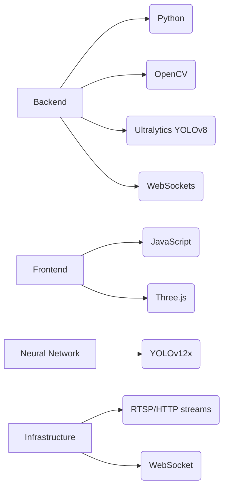

# PARKOVOZ-PRO - Parking Monitoring System

[English README](README.md) | [Russian README](README_RU.md)


*Interactive demonstration of the system*

**PARKOVOZ-PRO** is a comprehensive solution for automatic parking space monitoring using neural networks. The system analyzes a video stream in real time, detects free/occupied parking spots, and provides a convenient web interface for data visualization.

## Technology Stack


```mermaid
graph LR
    A[Backend] --> B(Python)
    A --> C(OpenCV)
    A --> D(Ultralytics YOLOv8)
    A --> E(WebSockets)
    
    F[Frontend] --> G(JavaScript)
    F --> H(Three.js)
    
    I[Neural Network] --> J(YOLOv12x)
    
    K[Infrastructure] --> L(RTSP/HTTP streams)
    K --> M(WebSocket)
```

## Installation and Launch

### Requirements
- Python 3.7+
- NVIDIA GPU (recommended)
- Access to an RTSP/HTTP camera

### Step-by-step installation

1. Clone the repository:
```bash
git clone https://github.com/ollxel/PARKOVOZ-PRO
cd PARKOVOZ-PRO
```

2. Install dependencies:
```bash
pip3 install -r requirements.txt
```

3. Download the YOLOv12x model:
```bash
wget https://example.com/yolov12x.pt -O RealParking/backend/yolov12x.pt
cp RealParking/backend/yolov12x.pt ToyParking/backend/
```

### Running the system

Backend:
```bash
python3 main.py --url rtsp://your_camera_ip --device gpu
```

Frontend:
```bash
python3 -m http.server  # port - 8000
```

### Launch Parameters

| Parameter | Description | Default |
|----------|-------------|---------|
| `--url` | Video stream URL | Required |
| `--model` | Path to the model | `yolov12x.pt` |
| `--device` | Device (`cpu` / `gpu`) | `gpu` |
| `--ws-port` | WebSocket port | `9000` |

### Hotkeys

| Key | Action |
|-----|--------|
| `S` | Save snapshot |
| `R` | Start/stop recording |
| `M` | Toggle mode |
| `P` | Annotation mode |
| `Q` | Exit system |

## License
The project is distributed under the **GPLv3** license.  
Full text available in the file:  
https://github.com/ollxel/PARKOVOZ-PRO/blob/main/LICENSE
