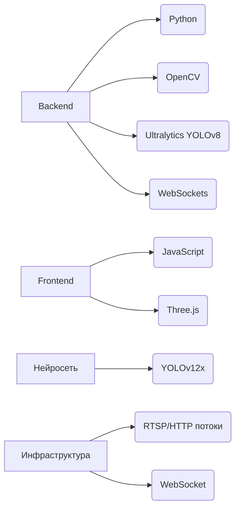

# PARKOVOZ-PRO  - Система мониторинга парковок  


*Интерактивная демонстрация работы системы*

**PARKOVOZ-PRO** - комплексное решение для автоматического мониторинга парковочных мест с использованием нейросетей. Система анализирует видеопоток в реальном времени, определяет свободные/занятые места и предоставляет удобный веб-интерфейс для визуализации данных.

## Технологический стек


```mermaid
graph LR
    A[Backend] --> B(Python)
    A --> C(OpenCV)
    A --> D(Ultralytics YOLOv8)
    A --> E(WebSockets)
    
    F[Frontend] --> G(JavaScript)
    F --> H(Three.js)
    
    I[Нейросеть] --> J(YOLOv12x)
    
    K[Инфраструктура] --> L(RTSP/HTTP потоки)
    K --> M(WebSocket)
```

## Установка и запуск

### Требования
- Python 3.7+
- NVIDIA GPU (рекомендуется)
- Доступ к RTSP/HTTP камере

### Пошаговая установка

1. Клонируйте репозиторий:
```bash
git clone https://github.com/ollxel/PARKOVOZ-PRO
cd PARKOVOZ-PRO
```

2. Установите зависимости:
```bash
pip3 install -r requirements.txt
```

3. Загрузите модель YOLOv12x:
```bash
wget https://example.com/yolov12x.pt -O RealParking/backend/yolov12x.pt
cp RealParking/backend/yolov12x.pt ToyParking/backend/
```

### Запуск системы
Backend:
```bash
python3 main.py--url rtsp://your_camera_ip --device gpu
```

Frontend:
```bash
python3 -m http.server #port - 8000
```

### Параметры запуска
| Параметр | Описание | По умолчанию |
|----------|----------|--------------|
| `--url` | URL видеопотока | Обязательный |
| `--model` | Путь к модели | `yolov12x.pt` |
| `--device` | Устройство (`cpu`/`gpu`) | `gpu` |
| `--ws-port` | WebSocket порт | `9000` |


### Горячие клавиши
| Комбинация | Действие |
|------------|----------|
| `S` | Сохранить снимок |
| `R` | Старт/стоп записи |
| `M` | Переключение режима |
| `P` | Режим разметки |
| `Q` | Выход из системы |

## Лицензия
Проект распространяется под лицензией **GPLv3**.  
Полный текст доступен в файле https://github.com/ollxel/PARKOVOZ-PRO/blob/main/LICENSE

